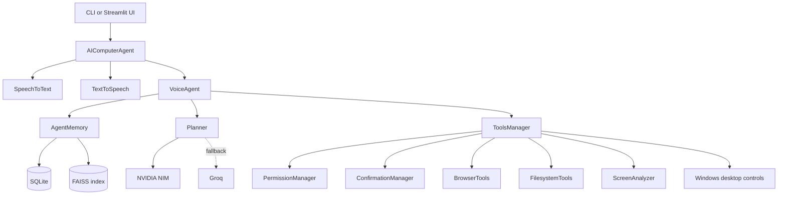

# AI Voice Assistant

A Windows desktop automation assistant controlled through text or voice. It can open applications and websites, control the mouse and keyboard, manage media and system information, search and manage files, create PDFs, capture and analyze the screen, and keep a lightweight conversation and action history.

The project exposes two interfaces:

- A command-line interface in `app.py`.
- A Streamlit user interface in `ui/streamlit_app.py`.

## Features

- Text commands through the terminal or Streamlit.
- Five-second microphone recording and speech-to-text.
- Text-to-speech responses with sanitized spoken output.
- NVIDIA NIM as the primary text and vision provider.
- Groq as an optional fallback for planning and vision, and the current STT provider.
- Application launching for Chrome, Edge, Firefox, VS Code, and Notepad.
- Website navigation through Playwright.
- Mouse, keyboard, media, and system controls.
- Fuzzy filename matching for file search and deletion.
- Public Desktop support at `C:\Users\Public\Desktop`.
- Confirmation workflow for destructive operations.
- Streamlit approval and cancellation controls for pending confirmations.
- PDF creation with ReportLab.
- Screenshot capture and screen-image analysis.
- SQLite conversation, action, preference, and semantic-memory storage.
- FAISS-backed semantic memory when embeddings are used.

## Architecture



## Command Workflow

1. The user submits a text command or records a voice command.
2. Voice input is converted to text by `SpeechToText`.
3. `VoiceAgent` loads recent actions, recent conversations, saved paths, preferences, and short-term memory.
4. `Planner` sends the command and available tool descriptions to the primary NVIDIA model.
5. The response is parsed into a validated `ActionPlan`.
6. Special intent guards normalize common requests:
   - Website names are routed to browser navigation.
   - Screen-analysis requests use the vision analyzer.
   - PDF requests use the direct PDF tool.
   - Delete requests use fuzzy matching and confirmation.
7. `ToolsManager` checks permissions and executes the selected tool.
8. Destructive actions create a pending confirmation with the exact target path or action.
9. The user can approve or cancel through voice, text, or the Streamlit confirmation panel.
10. Results are verified, stored in memory, displayed, and optionally spoken aloud.

## Requirements

- Windows.
- Python 3.10 or newer.
- A working microphone for voice input.
- A working audio output device for TTS.
- Google Chrome or another supported browser for browser automation.
- NVIDIA NIM credentials for primary text and vision tasks.
- Groq credentials for speech-to-text and optional fallback behavior.

## Installation

From the project directory:

```powershell
cd D:\projects\AI-Voice-Assistant
python -m venv .venv
.\.venv\Scripts\Activate.ps1
python -m pip install -r requirements.txt
```

If you use the existing workspace environment, activate or call its interpreter instead:

```powershell
D:\projects\envi\Scripts\python.exe -m pip install -r requirements.txt
```

PyAudio can require additional Windows audio support depending on the Python installation. If installation fails, install a compatible PyAudio wheel for your Python version or use the existing project environment.

## Configuration

Copy the example configuration to a local `.env` file:

```powershell
Copy-Item .env.example .env
```

Set your credentials in `.env`:

```env
NVIDIA_API_KEY=your_nvidia_api_key_here
GROQ_API_KEY=your_groq_api_key_here
```

Never commit `.env`. It is ignored by Git. Use `.env.example` as the safe template.

### Provider settings

The default models are configured for NVIDIA NIM:

```env
LLM_MODEL=meta/llama-3.2-11b-vision-instruct
VISION_MODEL=meta/llama-3.2-11b-vision-instruct
STT_MODEL=whisper-large-v3
```

Behavior:

- NVIDIA is tried first for planning and image analysis.
- Groq is used as a fallback if NVIDIA authorization, deployment, or structured-output behavior fails.
- Groq is currently required for speech-to-text because the STT implementation uses the Groq Whisper endpoint.

### Confirmation settings

Destructive actions require approval by default:

```env
REQUIRE_CONFIRMATION_FOR_DESTRUCTIVE=true
CONFIRMATION_TIMEOUT_SECONDS=300
```

The default confirmation lifetime is five minutes. The Streamlit UI shows the pending action, exact target, remaining time, and Approve/Cancel controls.

### Desktop location

Desktop operations prefer:

```text
C:\Users\Public\Desktop
```

The file tools also recognize the normal user Desktop and OneDrive Desktop as fallback locations.

## Running the CLI

Start the interactive command loop:

```powershell
python app.py
```

Run one text command:

```powershell
python app.py "Open Chrome and search for AI news"
```

Start voice mode:

```powershell
python app.py --voice
```

List microphone devices:

```powershell
python app.py --list-devices
```

Examples:

```text
Open Chrome
Open BookMyShow website
Take a screenshot
Analyze what is on the left side of the screen
Find the Fibonacci file on the Desktop
Delete the Fibonacci file from the Desktop
Create a PDF about three freedom fighters of India
What is my CPU usage
```

For a destructive command, the assistant identifies the target and asks for approval. Reply with `yes`, `yes please`, `confirm`, `no`, or `cancel`.

## Running the Streamlit UI

Run the UI from the project root:

```powershell
streamlit run ui/streamlit_app.py
```

The UI provides:

- Text command submission by Enter or the Execute button.
- Five-second voice recording through the project microphone manager.
- Live CPU and memory status.
- Recent command history.
- Screenshot capture and persistent last-screenshot preview.
- System information and File Explorer shortcuts.
- Pending destructive-action approval and cancellation controls.

Do not launch the Streamlit entry point with plain `python` when you want the web UI. Use `streamlit run`.

## Tool Categories

### Applications

- Open and close supported local applications.
- List running applications.
- The application allowlist prevents arbitrary executable launches.

### Browser

- Navigate to websites.
- Search Google and YouTube.
- Click page elements.
- Fill browser form fields.
- Browser automation uses Playwright and can run headless or visible according to settings.

### Filesystem

- Search for the most similar filename.
- Create folders and text files.
- Create formatted PDFs.
- Rename, move, copy, read, and delete files.
- Delete operations resolve fuzzy names before asking for confirmation.
- Protected Windows directories are rejected.
- If no candidate reaches the similarity threshold, the result is `File not found`.

### Vision

- Capture and save a screenshot when explicitly requested.
- Analyze the current screen without saving it when the user asks what is visible.
- Locate UI elements, text, and interactive controls through the vision model.

### Desktop controls

- Type text.
- Press keys and shortcuts.
- Move, click, double-click, and scroll the mouse.
- Change volume and control media playback.
- Read CPU, memory, disk, process, and general system information.

## Confirmation Workflow

The safety flow is intentionally split into two stages:

1. The planner creates a plan.
2. The tool layer checks the exact target and requests confirmation only when execution is ready.

This avoids asking twice and ensures the confirmation describes the real file or system action. A pending confirmation can be completed with:

- Voice: `yes` or `no`.
- Text input: `yes`, `yes please`, `confirm`, `cancel`.
- Streamlit: Approve or Cancel buttons.

Confirmation callbacks are one-shot. If the action fails, the old confirmation is removed instead of repeating indefinitely.

## Memory and Storage

Runtime storage is created as needed:

- `memory/agent_memory.db`: SQLite database.
- `logs/agent.log`: application log.
- `temp/screenshots/`: saved screenshots.
- Operating-system temporary storage: temporary TTS audio files.
- Python `__pycache__` directories: generated bytecode.

These are generated files and should not be committed. They can be deleted safely when the assistant is stopped, although deleting the SQLite database removes saved conversation history, preferences, file paths, and semantic-memory records.

## File Guide

### Root files

- `.env`: Local secrets and runtime configuration. Never commit this file.
- `.env.example`: Safe configuration template with placeholder credentials.
- `.gitignore`: Prevents secrets, logs, temporary files, databases, and Python caches from entering Git.
- `app.py`: Main application composition. Defines `ToolsManager`, maps tool names to implementations, handles permissions and confirmations, and defines `AIComputerAgent` for text and voice commands.
- `requirements.txt`: Python dependencies for the agent, LLM clients, speech, browser automation, desktop control, Streamlit, PDF generation, and storage.
- `README.md`: Project setup, workflow, capabilities, troubleshooting, and file documentation.

### `agent/`

- `agent/graph.py`: LangGraph workflow. Understands commands, loads context, creates plans, routes special intents, executes tools, verifies results, and generates final responses.
- `agent/memory.py`: Agent-facing memory layer. Combines SQLite history, short-term memory, saved paths, preferences, and optional FAISS semantic memory.
- `agent/planner.py`: Builds action plans from the configured LLM. Parses and validates `ActionPlan` objects, retries malformed JSON, enforces confirmation for destructive tools, and falls back to Groq when NVIDIA fails.
- `agent/prompts.py`: System instructions, tool descriptions, planning guidance, and vision prompt builders supplied to the models.

### `config/`

- `config/settings.py`: Pydantic settings model. Loads `.env`, defines provider/model choices, browser settings, confirmation lifetime, storage paths, logging, and allowed applications.

### `memory/`

- `memory/database.py`: SQLite schema and data access. Stores preferences, conversation history, action logs, saved file paths, and semantic-memory embeddings.
- `memory/agent_memory.db`: Generated runtime database when the assistant runs. It is intentionally ignored by Git.

### `security/`

- `security/permission.py`: Assigns risk levels, checks application and protected-path permissions, and determines which tools require confirmation.
- `security/confirmation.py`: Creates, tracks, expires, approves, and cancels pending confirmations. Provides remaining-time information for the UI.

### `speech/`

- `speech/microphone.py`: Opens the microphone, records fixed-duration audio, streams chunks, and cleans up the PyAudio stream.
- `speech/stt.py`: Converts microphone audio to WAV and sends it to the configured Groq Whisper endpoint for transcription.
- `speech/tts.py`: Generates Edge TTS audio, removes non-alphanumeric characters before speaking, plays audio through pygame, and cleans up temporary MP3 files.

### `tools/`

- `tools/applications.py`: Starts and closes allowlisted Windows applications and lists running processes.
- `tools/browser.py`: Manages Playwright, browser lifecycle, navigation, Google/YouTube search, clicking, form filling, and browser screenshots.
- `tools/filesystem.py`: Implements file search, fuzzy matching, Public Desktop resolution, text/PDF creation, copying, moving, renaming, reading, and deletion.
- `tools/keyboard.py`: Types text, presses individual keys, and executes keyboard shortcuts.
- `tools/media.py`: Controls volume, mute state, playback, previous/next track, and related media keys.
- `tools/mouse.py`: Moves, clicks, double-clicks, scrolls, and performs mouse dragging.
- `tools/system.py`: Reports CPU, memory, disk, process, and system information and provides system actions such as shutdown, restart, and lock.

### `vision/`

- `vision/screenshot.py`: Captures full-screen or regional images, saves PNG screenshots, converts images to bytes, and reports screen size.
- `vision/screen_analyzer.py`: Encodes images as base64 and sends them to the NVIDIA vision model, with Groq fallback support for screen descriptions, element finding, text location, and UI extraction.

### `ui/`

- `ui/streamlit_app.py`: Streamlit front end. Provides command input, voice recording, action history, system status, screenshots, file explorer access, and confirmation controls. It adds the project root to `sys.path` so it can be launched reliably from the UI directory.


## Security Notes

- Never commit `.env` or paste API keys into source files.
- Rotate any key that has been exposed in terminal output, logs, commits, screenshots, or chat.
- Keep `REQUIRE_CONFIRMATION_FOR_DESTRUCTIVE=true` for normal use.
- The assistant can control the local computer, so run it only in a trusted environment.
- Browser automation can access accounts already signed in to the selected browser context.
- Protected Windows directories are blocked by filesystem safety checks.
- Review the exact target shown in the confirmation prompt before approving destructive actions.


## License

No license file is currently included in the repository. Add a license before distributing the project publicly.
